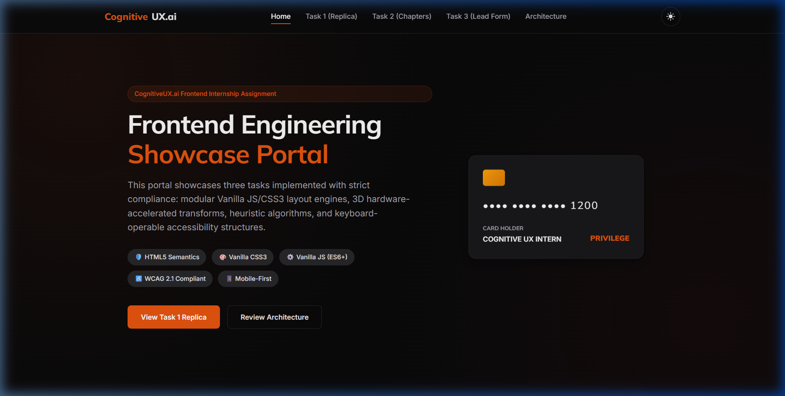
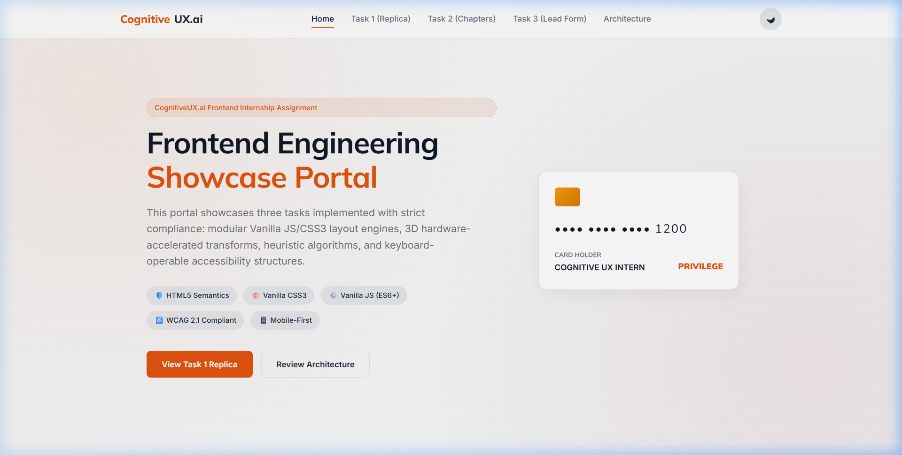
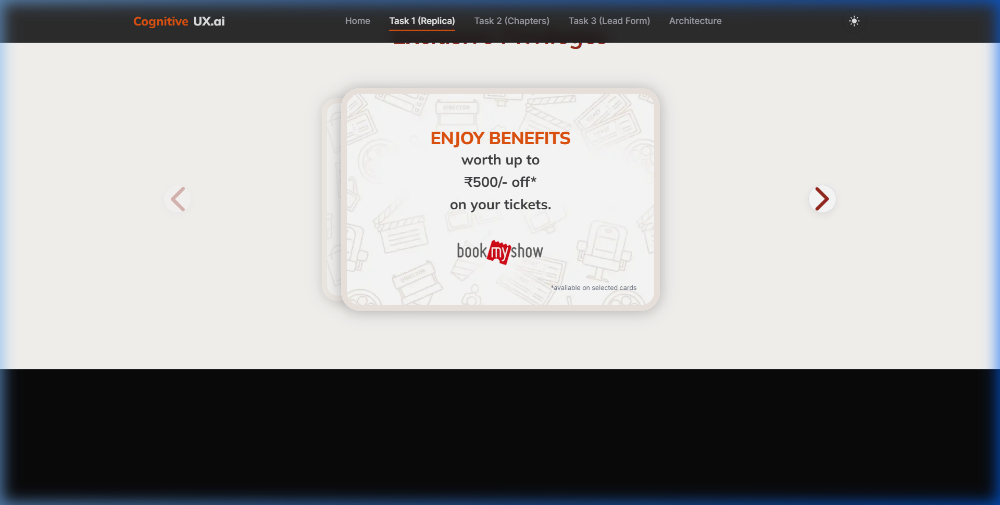
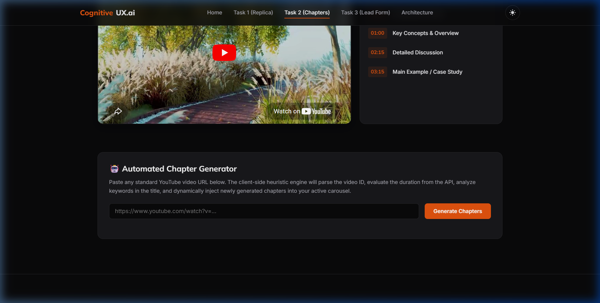
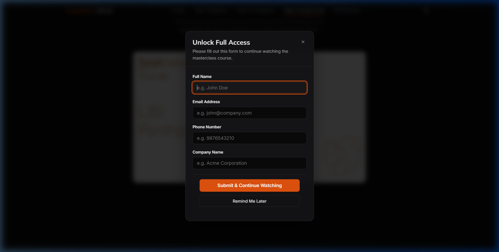

# CognitiveUX.ai Frontend Assignment Showcase


## 🔗 Live Demo
Visit the live interactive showcase page here:
👉 **[Live Project Demonstration URL](https://piyushxbhardwaj.github.io/cognitiveux-frontend-assignment/)**

## 📌 Key Highlights
* 💎 **Pixel-Perfect ICICI Bank Replica:** Replicates exact CSS spacing, Mulish typography, colors, and border shapes.
* 🚀 **Pure Vanilla Implementation:** Built entirely in HTML5, CSS3, and ES6+ JS with zero external dependencies.
* ⚙️ **Custom 3D Coverflow Engine:** Recalculates angled transforms, z-index depth, and captures touch swipes manually.
* ♿ **WCAG 2.1 AA Accessibility:** Focus trapping inside active modals, Escape key dismissals, and high contrast rings.
* 🌗 **Smooth Theme Switcher:** Light/dark variable modes with lag-free transition timings.
* 🔐 **Lead Capture Core:** Integrates playhead watching triggers, form validators, and dual browser storage logs.

---

# Project Overview

This repository contains the complete implementation of the CognitiveUX.ai Front-End Internship Assignment. It showcases a production-ready, highly polished, single-page application built strictly with HTML5, CSS3, and Vanilla JavaScript (ES6+).

The website showcases three distinct tasks:
1. **Task 1:** A pixel-perfect replica of the "Exclusive Privileges" section of the ICICI Bank Credit Card campaign page, including a custom-built 3D Coverflow slider engine.
2. **Task 2:** A YouTube Video Chapters system containing a sliding video carousel, time-synchronized chapters navigation, and a smart client-side heuristics-based chapter generator.
3. **Task 3:** An accessible, modal-driven Lead Capture experience triggered after exactly 6 seconds of cumulative watch time, with focus trapping and session management.

---

# Features

* **3D Slider Engine:** Hardware-accelerated 3D transforms (`translate3d`, `rotateY`, `scale`, and depth offsets) developed in pure Vanilla JS. Supports keyboard navigation and touch swipes.
* **YouTube Carousel & Sync:** Custom-built thumbnail strip with time-synced chapters that auto-highlight as the player advances.
* **Smart Heuristics Chapter Generator:** Client-side algorithm that evaluates metadata and duration from URL queries, dynamically injecting chapters rounded to neat time divisions.
* **Accessible Dialog Overlay:** Backdrop-blur overlay that traps keyboard focus inside form boundaries, captures Escape key commands to close, and manages session state.
* **Toast Notification Core:** Lightweight dynamic alerts that fade in/out on success or error prompts.
* **Dual Theme Core:** Premium dark/light themes with smooth transition variables.

---

# Folder Structure

The project has been organized into modular styles and scripts to keep responsibilities separate and maintainable:

```text
cognitiveux-assignment/
│
├── index.html
├── css/
│   ├── style.css
│   ├── task1.css
│   ├── task2.css
│   └── task3.css
├── js/
│   ├── main.js
│   ├── task1.js
│   ├── task2.js
│   └── task3.js
├── assets/
│   ├── ixigo.webp
│   ├── reliance_digital.webp
│   ├── bms.webp
│   ├── privilages_bg1.webp
│   ├── privilages_bg2.webp
│   ├── privilages_bg3.webp
│   ├── privilages_bg4.webp
│   ├── arrow_left.webp
│   └── arrow_right.webp
├── screenshots/
│   ├── task1_desktop.png
│   ├── task2_chapters.png
│   ├── task3_lead_modal.png
│   ├── dark_mode.png
│   ├── light_mode.png
│   ├── walkthrough_demo.mp4
│   └── task1_replica_demo.mp4
└── README.md
```

---

# Screenshots & Demo Videos

### Demo Videos
* 🎬 [Full Showcase Walkthrough (MP4)](./screenshots/walkthrough_demo.mp4) — Demonstrates carousel swipes, playback tracking, modal focus traps, and theme switches.
* 🎬 [Task 1 Slider Gestures (MP4)](./screenshots/task1_replica_demo.mp4) — Shows Coverflow translations and mouse/touch drag offsets.

### Showcase Screenshots

#### Home Page (Light & Dark Theme)



#### Task 1: Exclusive Privileges Replica Comparison
*Original Landing Page:*

*Our Replicated Section:*


#### Task 2: Chapter Sync & Heuristic Generator


#### Task 3: Glassmorphism Lead Capture Dialog


---

# Architecture Decisions

* **Modularity:** Separating each task's layout properties (CSS) and triggers (JS) prevents cross-contamination of styles, making the codebase highly scalable and manageable.
* **Namespace Safety:** Methods and global triggers are mounted on a single `window.App` namespace to prevent global scope contamination.
* **Session Management:** Using `sessionStorage` for temporary deferrals ("Remind me later") preserves playbacks for active sessions, while `localStorage` permanently blocks the modal once a converted user submits their info.

---

# Why Vanilla JS?

Assignment constraints strictly prohibit external frameworks (React, Vue, Angular) and utility libraries (jQuery, Bootstrap, Tailwind). 
Writing core components in vanilla JS yields major benefits:
- **Zero Dependencies:** Eliminates security vulnerabilities and breaking updates.
- **Ultra-Fast Performance:** The site initializes in milliseconds and features a lightweight footprint suitable for slow mobile networks.
- **High-Performance Slider:** Directly recalculating matrices in JS instead of pulling heavy libraries like Swiper.js reduces execution delays.

---

# Why Heuristic Chapters?

Extracting exact speech transcripts or generating summary indices in real-time requires backend resources, AI processors, or paid third-party endpoints. Since external web dependencies violate pure front-end guidelines:
- A client-side heuristic builder runs, extracting video IDs with a strict regex.
- The engine queries the Player API for the true duration, runs title keyword checks (e.g. matching "tutorial" or "review" to customize title templates), and splits timestamps into clean intervals (e.g., 15s or 30s) to mirror manual editing.

---

# Accessibility Features

Directly complies with WCAG 2.1 AA benchmarks:
* **Focus Trapping:** When the lead capture modal overlay is active, keydown listeners capture the `Tab` and `Shift + Tab` key sequences to lock focus inside the dialog, preventing background leaks.
* **Escape Key Dismiss:** Pressing `ESC` closes the modal automatically (treated as a temporary session deferral).
* **Focus Restoration:** Focus is returned to the video container once the modal dialog closes.
* **Contrast & Indicators:** Visible high-contrast focus rings around input fields and actionable triggers.
* **Screen Reader Support:** landmark tags (`<header>`, `<main>`, `<aside>`, `<footer>`) with explicit labels (`aria-label`, `aria-modal="true"`, `role="dialog"`).
* **Prefers-Reduced-Motion:** Slider transitions and animations are nested within `@media (prefers-reduced-motion: no-preference)` to respect OS specifications.

---

# Performance Optimizations

* **Resize Debouncing:** Debounces layout updates to prevent render loops.
* **CSS hardware acceleration:** Utilizes `will-change: transform` and CSS properties (`transform`, `opacity`) instead of trigger reflow geometry metrics (like `width` or `margin`).
* **Asynchronous API cues:** Loads the YouTube player iframe script asynchronously, mounting players only when loaded.

---

# Assumptions

* The custom YouTube URLs supplied during Task 2 testing support embedding. (Private or geoblocked video links may trigger player warning grids).
* The default typography relies on Google Fonts (Mulish and Inter). If the host lacks internet access, the typography degrades to Arial and system-ui fallbacks.
* **Asset Naming Typo:** We retained the original file names `privilages_bg1.webp` through `privilages_bg4.webp` (including their original spelling typo of 'privilege' as 'privilage') to align exactly with the original ICICI campaign page asset URLs and structures.

# Testing Strategy

To ensure production-grade stability without relying on external testing frameworks (like Jest or Cypress), we implemented a multi-stage validation matrix:

### 1. Manual Verification Matrix
* **Task 1 (3D Slider):** Swiping/dragging animations verified on real touch screen interfaces and simulated pointer drag events. Recalculated transformation offsets debounced on resize hooks.
* **Task 2 (Chapter Player):** Verified playhead time alignment checks (time margin boundaries) by loading course files. Checked URL regex parser against several malformed links.
* **Task 3 (Watch-time modal):** Checked watch-time tracking accumulators (cumulative time increases only when states are `PLAYING`). Verified storage persistence logic when submitting lead details or clicking "Remind Me Later".

### 2. Accessibility Verification
* **Focus Check:** Confirmed focus trapping logic cycles correctly using `Tab` and `Shift + Tab` without leaking selection highlights to underlying page containers.
* **Dismiss Check:** Verified ESC key presses dismiss modal layouts, writing deferral tokens to session storage.
* **Assistive Checks:** Validated landmark semantic tags and matching ARIA attribute indicators.

---

# Future Improvements

1. **Web Workers:** Move the heuristic generators onto background threads.
2. **IndexedDB Logs:** Use IndexedDB to manage leads storage for schema configurations.
3. **Leads Encryption:** Protect saved credentials using Web Cryptography API standards.

---

# Setup Instructions

### Quick Start (Terminal)
```bash
# 1. Clone this repository
git clone https://github.com/piyushxbhardwaj/cognitiveux-frontend-assignment.git

# 2. Enter the project root directory
cd cognitiveux-frontend-assignment

# 3. Start a local HTTP server (Python)
python -m http.server 8000
```

### Manual Installation
1. **Clone or download the source directory.**
2. **Initialize a local HTTP server** to satisfy browser security (CORS) rules for YouTube player scripts:
   * **Python:** Run `python -m http.server 8000` in the root folder, and visit `http://localhost:8000`.
   * **Node.js:** Run `npx serve .` or use any static hosting package.
3. **Open your web browser** and navigate to `http://localhost:8000`.
